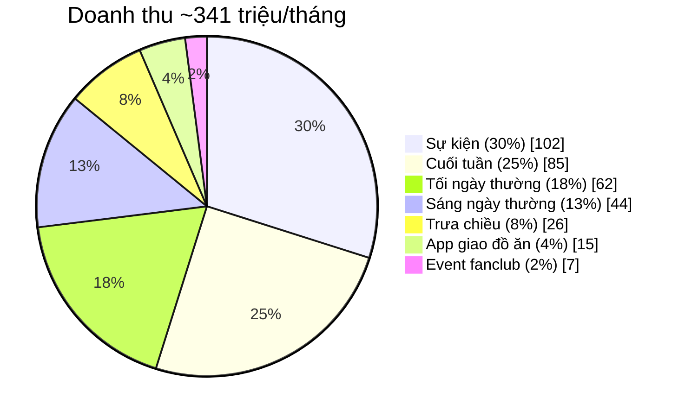
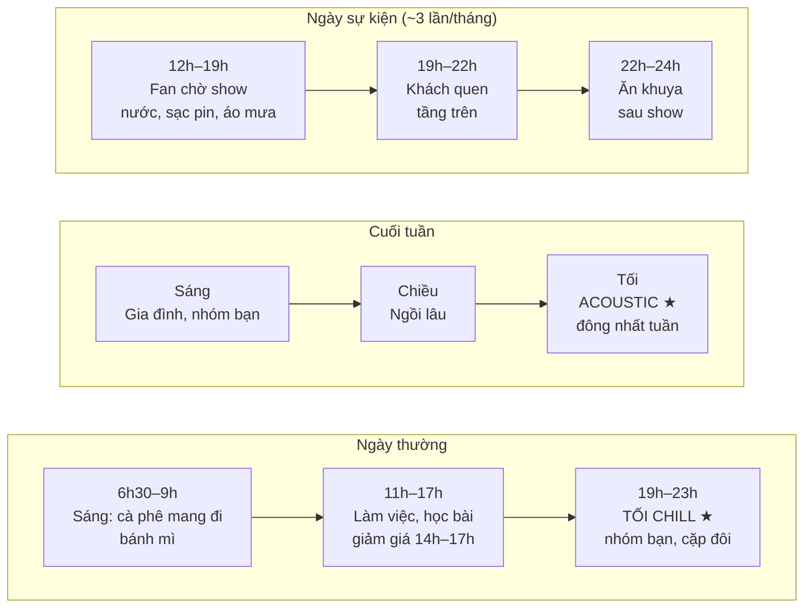
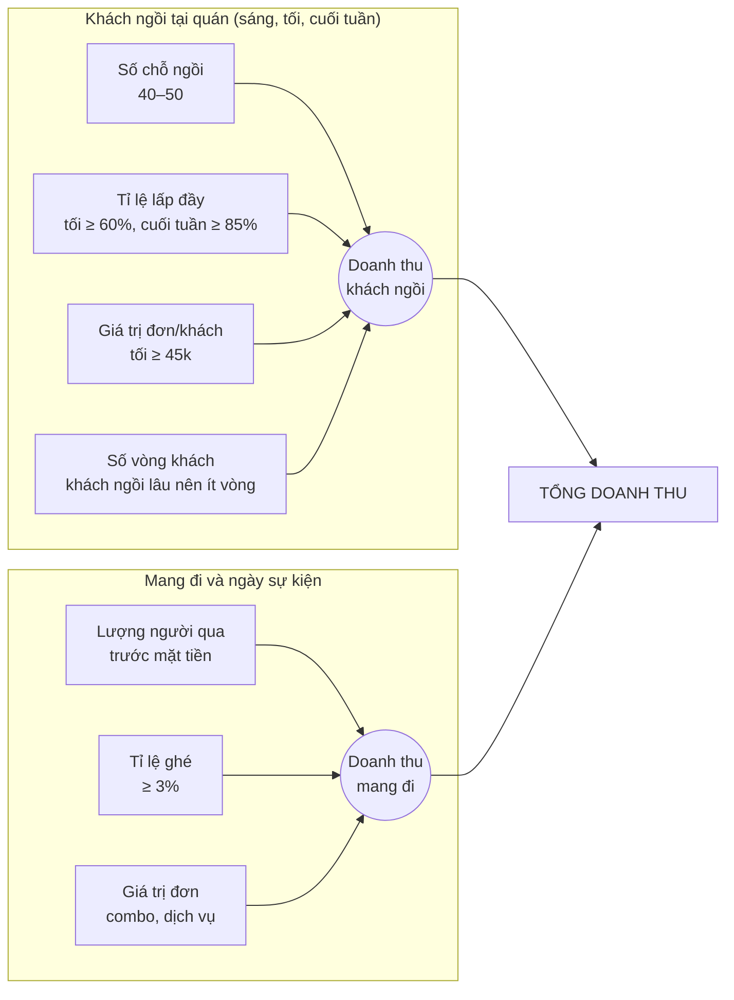
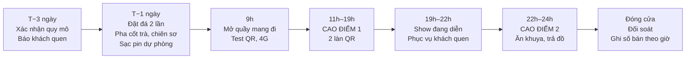
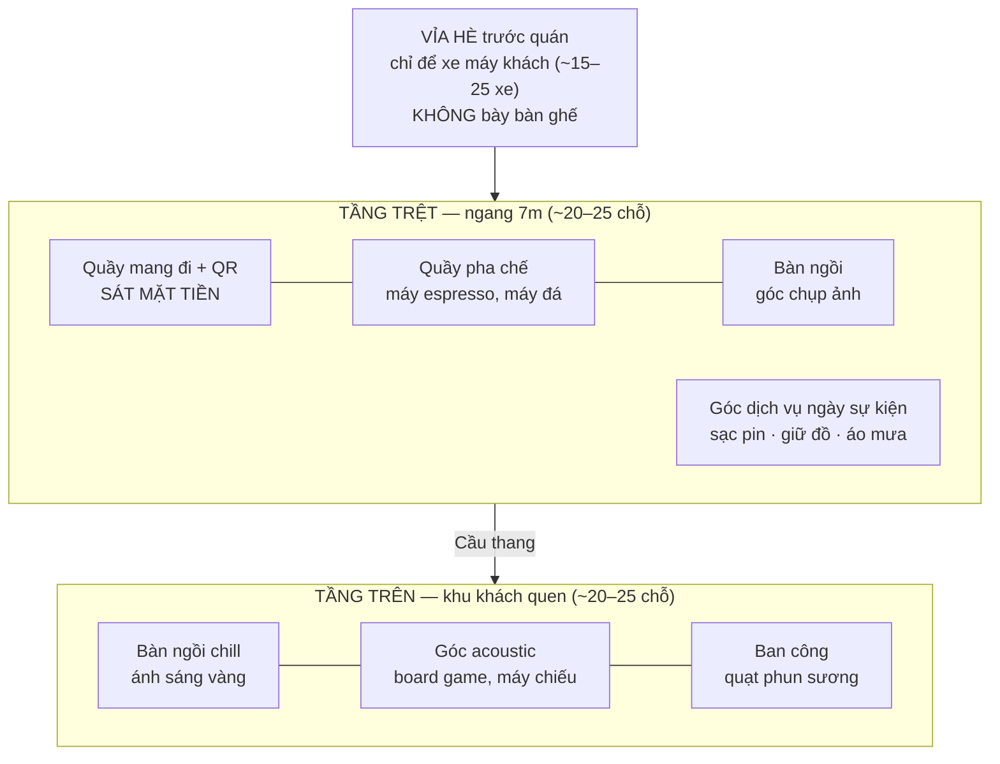
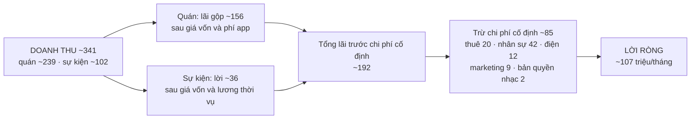
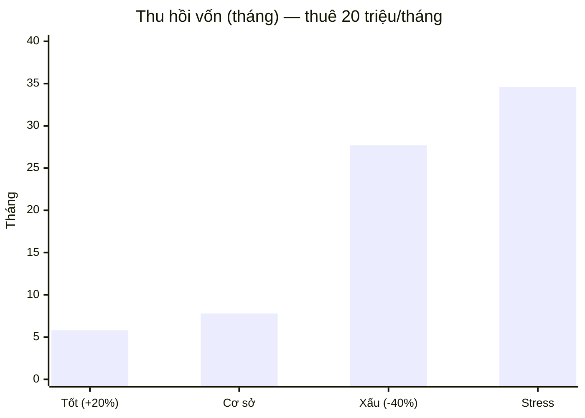
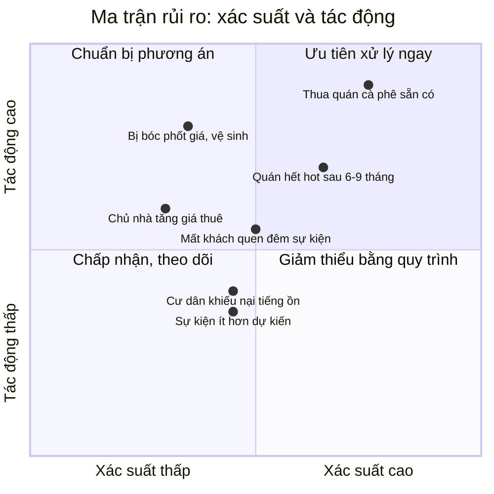
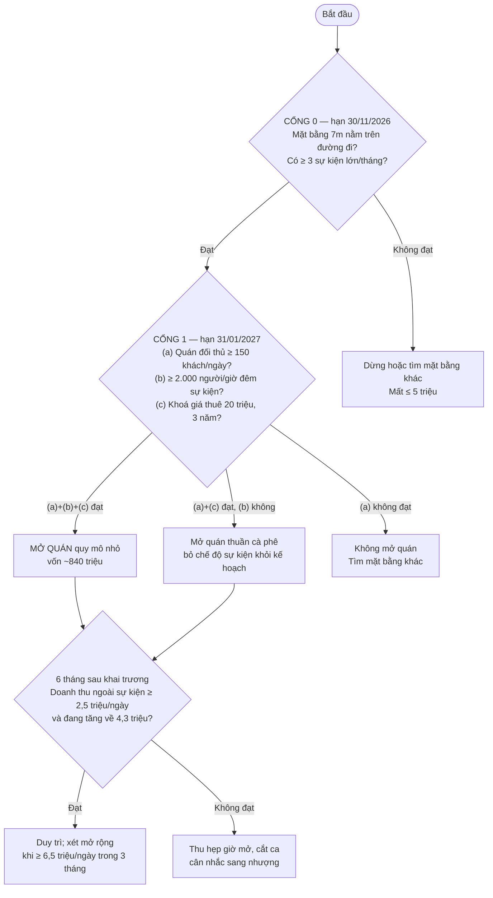
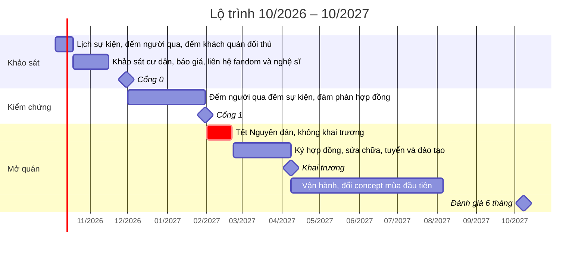

# Kế hoạch & Chiến lược kinh doanh — Quán cà phê + "trạm fan" tại Vạn Phúc City

> **Phiên bản 3.3** · Ngày lập: 03/10/2026
> **Cập nhật v3.3:** **bỏ kiosk**. Ngày sự kiện phục vụ ngay tại quán (quầy mang đi sát mặt tiền, trong phạm vi mặt bằng). Thêm **10 hình minh hoạ** (Mermaid, xem tốt trên VS Code, GitHub, Obsidian, Notion).
> **Cập nhật v3.1:** sự kiện giảm còn **~30% doanh thu**; quy mô nhỏ là phương án chính.
> **Cập nhật v3.2:** có giá thuê thật 🟢 **mặt tiền ngang 7m, 20 triệu/tháng** (theo chủ đầu tư). Tài chính chính thức ở mục 8.9.
> Lăng kính: **CEO** (chọn cược, điều kiện dừng) · **CCO** (doanh thu, giá, kênh) · **CSO** (mục tiêu và thưởng theo người) · **COO** (vận hành).
> **Thay đổi lớn so với v2.0 (theo chỉ đạo của chủ đầu tư):**
> - Sự kiện chỉ chiếm **~30% doanh thu** (v3.1; v3.0 là 40%). **~70% còn lại** từ quán cà phê: **sáng ngày thường, tối mỗi ngày, cuối tuần.**
> - Mô hình là **"quán cà phê khu đô thị có chế độ sự kiện"**. **Không có kiosk**: ngày sự kiện, quán mở quầy mang đi sát mặt tiền.
> - Quy mô quán, chi phí cố định và vốn đầu tư tăng. Kèm theo đó **đòn bẩy hoạt động cao hơn**, tức tháng tốt lời nhiều hơn và tháng xấu lỗ nhanh hơn (mục 8).
>
> Quy ước: 🟢 đã kiểm chứng · 🟡 ước tính hợp lý theo thị trường · 🔴 giả định, phải đo trước khi bỏ vốn lớn.
> Đầu vào từ chủ đầu tư: **4–5 sự kiện/tháng** 🟡 · **tỷ trọng sự kiện mục tiêu ~30% doanh thu** · **giá thuê mặt tiền 7m: 20 triệu/tháng** 🟢.

---

## 0. Tóm tắt điều hành

| Hạng mục | Nội dung |
|---|---|
| **Quyết định** | Đi tiếp theo 3 cổng: khảo sát (≤ 5 triệu) → kiểm chứng cả **quán cà phê** và **sự kiện** → mở quán (~0,9–1,1 tỷ, có phương án quy mô nhỏ) |
| **Định vị** | **Quán cà phê khu đô thị** cho cư dân và giới trẻ: sáng mang đi, **tối ngồi chill**, cuối tuần cho nhóm bạn và gia đình. Ngày có show chuyển sang **"trạm tiếp sức của fan"** |
| **Cơ cấu doanh thu mục tiêu (v3.1)** | Sự kiện ~30% · Cuối tuần ~25% · Tối ngày thường ~18% · Sáng ngày thường ~13% · Trưa chiều ~8% · App + event fanclub ~6% |
| **Crux** | Quán cà phê gánh ~70% doanh thu nên **phải thắng các quán cà phê khác trong khu**. Với giá thuê 20 triệu, không có sự kiện nào thì cần ≥ **~4,3 triệu/ngày** để hoà vốn |
| **Rủi ro mới** | **Đêm sự kiện "ăn" mất khách tối quen.** Fan chiếm chỗ, ồn, kẹt xe, khách quen tránh đi. Phải tách không gian (mục 5.3) |
| **Thu hồi vốn (v3.3, thuê 20 triệu, vốn ~840 triệu)** | Cơ sở **~8 tháng** · Xấu **~28 tháng** · Tốt ~6 tháng · Stress ~35 tháng |
| **Khuyến nghị quy mô** | Quy mô nhỏ 40–50 chỗ trên mặt tiền 7m. Chi phí cố định ~85 triệu/tháng. Mở rộng sau khi vượt ngưỡng mục 8.6 |
| **Giá thuê** | 🟢 20 triệu/tháng, **dưới trần 25 triệu** của v3.1. **Khoá giá 3 năm trước khi ký** |

---

### Danh sách hình

| Hình | Nội dung | Mục |
|---|---|---|
| 1 | Cơ cấu doanh thu | 0 |
| 2 | Một ngày và một tuần của quán | 1.2 |
| 3 | Cách quán tạo ra doanh thu | 4.1 |
| 4 | Sơ đồ mặt bằng mặt tiền 7m | 5.3 |
| 5 | Dòng thời gian ngày sự kiện | 5.2 |
| 6 | Doanh thu và chi phí một tháng | 8.9 |
| 7 | Thời gian thu hồi vốn theo kịch bản | 8.9 |
| 8 | Ma trận rủi ro | 10.1 |
| 9 | Ba cổng quyết định vốn | 10.2 |
| 10 | Lộ trình | 12 |

> Hình vẽ bằng **Mermaid**. Mở file bằng VS Code (extension "Markdown Preview Mermaid Support"), GitHub, Obsidian hoặc Notion để xem hình.

### Hình 1 — Cơ cấu doanh thu mục tiêu mỗi tháng (triệu đồng)

Đọc hình: **~70% doanh thu đến từ quán cà phê**, trong đó tối và cuối tuần là phần lớn nhất. Sự kiện là phần cộng thêm.

---

## 1. Chẩn đoán (CEO)

### 1.1 Bối cảnh

- Vạn Phúc City: khu đô thị lớn ở khu vực Hiệp Bình, Thủ Đức cũ, TP.HCM, có dãy nhà phố thương mại và bãi tổ chức sự kiện. 🟡
- Sự kiện đã tổ chức theo tài liệu tham khảo: Anh Trai Say Hi, Em Xinh Say Hi, K-Pop Super Concert, Tokyo Girls Collection, lễ hội âm nhạc. 🔴 Cần đối chiếu.
- Tệp khách sự kiện đông nhất nhiều khả năng là **fan Vpop**, phần lớn là học sinh, sinh viên. Họ **nhạy giá với đồ ăn uống**.

### 1.2 Văn hoá cà phê Việt Nam (nền của ~70% doanh thu)

| Khung giờ | Hành vi điển hình | Nhu cầu cụ thể |
|---|---|---|
| **Sáng ngày thường** (6h30–9h) | Mua mang đi trên đường đi làm, hoặc ngồi nhanh 15–30 phút | Nhanh, giá 20–29k, có chỗ dừng xe máy tiện |
| **Trưa, chiều** (11h–17h) | Ngồi làm việc, học bài, gặp đối tác | Wifi mạnh, ổ cắm, máy lạnh, yên tĩnh |
| **Tối** (19h–23h) | **"Đi cà phê" là hoạt động giải trí chính của giới trẻ**: tụ tập, trò chuyện, ngồi 2–3 tiếng | Không gian đẹp để chụp ảnh, nhạc, ánh sáng, đồ nhâm nhi (hạt hướng dương, khô gà, bánh tráng) |
| **Sáng cuối tuần** | Gia đình, nhóm bạn đi cà phê sáng, ngồi lâu | Bàn rộng, có góc cho trẻ em, ăn sáng nhẹ |
| **Tối cuối tuần** | Đông nhất tuần. Nhóm bạn, cặp đôi | **Acoustic, nhạc sống**, board game, không gian ngoài trời hoặc ban công |

**Điểm văn hoá đặc thù cần đáp ứng:**
- **Giữ xe miễn phí** cho khách là gần như bắt buộc. Thu phí giữ xe ở quán cà phê dễ bị đánh giá xấu.
- **Ngồi lâu là bình thường.** Doanh thu mỗi chỗ ngồi phụ thuộc vào món gọi thêm, không phải vòng quay bàn.
- **Trà đá miễn phí** là kỳ vọng mặc định ở nhiều quán bình dân. Quán tầm trung có thể bỏ, nhưng nên có nước lọc miễn phí.
- Cà phê "đặc sản Việt" đang là xu hướng: **cà phê muối, cà phê cốt dừa, bạc xỉu, cà phê trứng**.

### Hình 2 — Một ngày và một tuần của quán

Đọc hình: dấu ★ là các khung **đem lại nhiều doanh thu nhất**. Pha chế giỏi nhất nên xếp vào ca tối và cuối tuần.

### 1.3 Crux

> **Với ~70% doanh thu từ quán, bài toán chính là: quán phải tự đứng được như một quán cà phê bình thường trong khu đô thị, và không để các đêm sự kiện làm mất khách quen.**

Hệ quả:
1. **Ngưỡng sống còn:** với giá thuê 20 triệu, doanh thu ngoài sự kiện **≥ ~4,3 triệu/ngày** thì quán sống được kể cả khi không có sự kiện nào. Có sự kiện ở mức v3.1 thì ngưỡng hạ xuống **~2,5 triệu/ngày** (mục 8.9).
2. **Đối thủ chính đổi:** không còn là hàng rong ngày concert, mà là **các quán cà phê hiện có trong khu** và các chuỗi (Highlands, Phúc Long, Katinat, cà phê take-away). Cần khảo sát họ trước.
3. **Đêm sự kiện có thể "ăn" mất khách tối:** sự kiện thường rơi vào tối cuối tuần, đúng khung đông khách quen nhất.
4. **Quy mô lớn hơn làm tăng đòn bẩy hoạt động:** chi phí cố định tăng từ 55 lên ~100–120 triệu/tháng.

---

## 2. Chính sách định hướng (CEO)

### 2.1 Chơi ở đâu — cơ cấu doanh thu mục tiêu (v3.1, kịch bản cơ sở)

| Nguồn | Doanh thu/tháng 🔴 | Tỷ trọng | Ưu tiên |
|---|---|---|---|
| **Sự kiện** (≈ 3 sự kiện lớn × 34–37 triệu; bỏ sự kiện nhỏ) | ~102 triệu | **~30%** | ★★ |
| **Cuối tuần** (8 ngày × ~10,6 triệu) | ~85 triệu | ~25% | ★★★ |
| **Tối ngày thường** (22 ngày × 70 khách × 40k) | ~62 triệu | ~18% | ★★★ |
| Sáng ngày thường (22 ngày × 80 ly × 25k) | ~44 triệu | ~13% | ★★ |
| Trưa, chiều ngày thường (22 ngày × 40 ly × 30k) | ~26 triệu | ~8% | ★ |
| App giao đồ ăn | ~15 triệu | ~4% | ★ |
| Event fanclub (2 event × 100 ly × 35k) | ~7 triệu | ~2% | ★★ |
| **Tổng** | **~341 triệu** | 100% | |

Buổi tối (ngày thường + cuối tuần) và cuối tuần là **trục chính** của quán. Sự kiện là phần cộng thêm.

### 2.2 Thắng bằng gì

1. **Không gian tối đáng ngồi:** ánh sáng vàng ấm, ban công hoặc sân ngoài trời có quạt phun sương, góc chụp ảnh đổi theo mùa.
2. **Lịch hoạt động tối cố định:** acoustic tối thứ 6 và thứ 7; board game; tối chiếu phim hoặc livestream concert cho fandom.
3. **Cà phê đặc sản Việt giá dễ chịu:** cà phê muối, bạc xỉu, cốt dừa ở mức 25–39k.
4. **Đồ nhâm nhi kiểu Việt cho buổi tối:** hạt hướng dương, khô gà lá chanh, bánh tráng trộn, khoai lang lắc.
5. **Chế độ sự kiện (tại quán, không kiosk):** quầy mang đi sát mặt tiền, đủ thứ fan cần (nước đá, sạc pin, áo mưa, giữ đồ, bàn phát quà miễn phí), **giữ nguyên giá**.
6. **Tách không gian:** tầng trên hoặc khu trong nhà dành cho khách quen vào đêm sự kiện.

### 2.3 Không làm

- ❌ Tăng giá ngày sự kiện.
- ❌ Thu phí giữ xe với khách quán.
- ❌ Menu nhiều nền ẩm thực; lẩu, ramen, buffet; takoyaki, jianbing, mala.
- ❌ Bán merch có hình nghệ sĩ khi chưa có bản quyền.
- ❌ Mở quán quy mô lớn ngay từ đầu (mục 8.6).
- ❌ Lấn chiếm vỉa hè.
- ❌ Phát nhạc thương mại hoặc tổ chức acoustic **mà chưa xử lý bản quyền âm nhạc** (mục 9).

---

## 3. Khách hàng & nhu cầu

| Phân khúc | Khi nào | Cần gì | Giá trị đơn 🔴 |
|---|---|---|---|
| **Người đi làm, cư dân** | Sáng ngày thường | Mang đi nhanh, bánh mì | 25–45k |
| **Freelancer, sinh viên học bài** | Trưa, chiều | Wifi, ổ cắm, yên tĩnh, refill trà | 30–50k |
| **Nhóm bạn trẻ, cặp đôi** | **Tối mỗi ngày** | Không gian đẹp, nhạc, đồ nhâm nhi, ngồi 2–3 tiếng | 40–70k/người |
| **Gia đình** | **Sáng cuối tuần** | Bàn rộng, góc trẻ em, món cho trẻ (sữa chua, nước ép) | 100–250k/bàn |
| **Nhóm bạn cuối tuần** | **Tối cuối tuần** | Acoustic, board game, combo nhóm | 150–300k/bàn |
| **Fan đi show** | Ngày sự kiện, 12h–19h và 22h–24h | Nước đá, đồ ăn cầm tay, sạc pin, áo mưa, giữ đồ, chỗ ngồi | 30–80k/người |
| **Fanclub** | Ngày thường, cuối tuần | Event sinh nhật idol, cupsleeve, xem livestream chung | Cam kết số ly tối thiểu |

---

## 4. Động cơ doanh thu (CCO)

### 4.1 Công thức doanh thu theo khung giờ

> **Doanh thu = Số chỗ ngồi × Tỉ lệ lấp đầy × Giá trị đơn/khách × Số vòng khách** (khung ngồi)
> **Doanh thu = Lượng người qua × Tỉ lệ ghé × Giá trị đơn** (mang đi, sự kiện)

| Khung | Đòn bẩy chính | Chỉ số theo dõi |
|---|---|---|
| Sáng | Tốc độ, vị trí dừng xe | Ly/giờ, thời gian chờ |
| Trưa, chiều | Lấp chỗ trống bằng khách làm việc | Tỉ lệ lấp đầy 14h–17h |
| **Tối** | **Món gọi thêm** (khách ngồi lâu) | Giá trị đơn/khách, số món/bàn |
| **Cuối tuần** | Lấp đầy + combo nhóm | Tỉ lệ lấp đầy, giá trị đơn/bàn |
| Sự kiện | Công suất giờ cao điểm | Ly/giờ, lãi ròng/đêm |

### Hình 3 — Cách quán tạo ra doanh thu

Đọc hình: với khách ngồi lâu kiểu Việt, **đòn bẩy lớn nhất là giá trị đơn mỗi khách** (gọi thêm đồ nhâm nhi, combo), không phải số vòng khách.

**Rò rỉ doanh thu:** khách tối ngồi 3 tiếng chỉ gọi 1 ly · khách quen bỏ đi đêm sự kiện · hết chỗ cuối tuần · hết đá hoặc ly đêm sự kiện · thất thoát tiền mặt.

### 4.2 Menu cà phê (~70% doanh thu)

| Nhóm | Món | Giá 🟡 | Biên gộp 🟡 |
|---|---|---|---|
| Cà phê Việt | Cà phê đen/sữa đá, bạc xỉu | 20–29k | 70–80% |
| Cà phê đặc sản Việt | Cà phê muối, cốt dừa, cà phê trứng | 29–39k | 65–75% |
| Espresso | Latte, americano | 35–45k | 70–75% |
| Trà | Trà tắc, trà chanh, trà trái cây, trà sen vàng | 15–39k | 70–85% |
| Matcha, cacao | Matcha latte, cacao đá | 35–45k | 60–70% |
| Sinh tố, nước ép | Bơ, xoài, cam | 30–45k | 50–60% |
| **Đồ nhâm nhi tối** | Hạt hướng dương, khô gà, bánh tráng trộn, khoai lang lắc | 15–45k | 55–70% |
| Ăn sáng, bánh | Bánh mì, croissant, bánh bông lan | 20–35k | 40–50% |
| Cho trẻ em (cuối tuần) | Sữa chua, nước ép, bánh flan | 15–30k | 55–65% |

### 4.3 Menu chế độ sự kiện (rút gọn, bán ở quầy mang đi sát mặt tiền)

| Món | Giá 🟡 |
|---|---|
| Nước suối lạnh | 10–15k |
| Trà tắc, trà chanh | 15–20k |
| Trà trái cây | 25–35k |
| Bánh tráng hộp, xiên chiên | 5–25k |
| Corn dog (món "wow") | 25–35k |
| Mì cay (sau show) | 39–49k |
| **Dịch vụ:** áo mưa, quạt, khăn lạnh, sạc pin, giữ đồ, glitter | 10–50k |

### 4.4 Combo theo khung giờ

| Combo | Thành phần | Giá |
|---|---|---|
| "Sáng đi làm" | Cà phê sữa + bánh mì | 39k |
| "Tối chill" (2 người) | 2 nước + 1 đĩa hạt hoặc khô gà | 89k |
| "Hội bạn cuối tuần" (4 người) | 4 nước + 2 đồ nhâm nhi | 179k |
| "Gia đình cuối tuần" | 2 cà phê + 2 nước trẻ em + 2 bánh | 149k |
| "Đi show" | Trà tắc + bánh tráng | 35k |
| "Ăn khuya sau show" | Mì cay + trà tắc | 59k |

### 4.5 Giá và chống "ngồi lâu gọi ít"

- Không cấm ngồi lâu (trái văn hoá). Thay vào đó: **refill trà miễn phí 1 lần**, **gợi ý món nhâm nhi sau 60 phút**, combo nhóm rẻ hơn gọi lẻ.
- Khung 14h–17h: **giảm 10–15%** để lấp chỗ trống.
- Giá trên app giao đồ ăn cao hơn tại quán để bù phí hoa hồng 🟡 ~20–30%.

### 4.6 Phụ thuộc tập trung

- **Sự kiện (~30% doanh thu) phụ thuộc một địa điểm và vài nhà tổ chức.** Đây là lý do giữ làm trần phụ thuộc khi lập kế hoạch (mục 8.4).
- **Cuối tuần + tối (~43%)** phụ thuộc vào việc quán có "hot" hay không. Quán cà phê Việt có vòng đời trend ngắn. → **Đổi concept trang trí và menu mùa 3–4 tháng/lần.**

---

## 5. Vận hành (COO)

### 5.1 Giờ mở cửa và ca làm

| Ca | Giờ | Ngày thường | Cuối tuần | Ngày sự kiện |
|---|---|---|---|---|
| Sáng | 6h30–14h | 2 người | 3 người | 3 người |
| Tối | 14h–23h | 3 người | 4 người | 4 người + 3–4 thời vụ (quầy mang đi, dịch vụ, bếp) |
| Khuya (chỉ ngày sự kiện) | 23h–24h30 | — | — | 3 người |

- Lương bán thời gian TP.HCM 🟡 ~25–30k/giờ.
- Ca tối và cuối tuần **cần người pha chế giỏi nhất**, vì đó là khung doanh thu ngồi cao nhất.

### 5.2 SOP ngày sự kiện

| Thời điểm | Việc |
|---|---|
| T−3 ngày | Xác nhận quy mô, giờ mở cổng; **thông báo khách quen** về khung giờ đông và khu dành riêng; đăng fanpage |
| T−1 ngày | Đặt đá giao 2 lần (10h, 17h); pha cốt trà; chiên sơ; sạc pin dự phòng; in bảng giá và QR |
| T−0, 9h | Chuyển tầng trệt sang chế độ sự kiện: mở quầy mang đi sát mặt tiền, bàn phát quà, góc chụp ảnh; test QR và 4G dự phòng |
| 11h–19h | Quầy mang đi chạy song song với khu ngồi. 2 làn QR, 1 người chỉ rót nước |
| 19h–22h | Giảm ca quầy mang đi; **phục vụ khách quen ở tầng trên như bình thường** |
| 22h–24h30 | Chế độ ăn khuya; trả đồ giữ hộ |
| Sau đóng cửa | Đối soát, ghi số bán theo giờ |

### Hình 5 — Dòng thời gian ngày sự kiện

### 5.3 Tách không gian để giữ khách quen

| Khu | Ngày thường | Ngày sự kiện |
|---|---|---|
| Tầng trệt / mặt tiền | Quầy mang đi + chỗ ngồi | **Quầy mang đi mở rộng**, góc dịch vụ (sạc pin, giữ đồ, áo mưa), bàn phát quà |
| Tầng trên / khu trong | Chỗ ngồi chill | **Dành cho khách quen**, có thể nhận đặt chỗ trước. Giữ nhạc và không khí quán |
| Bãi xe | Giữ xe miễn phí cho khách quán | **Ưu tiên khách quán**. Phối hợp với đội giữ xe khu để tránh bị chiếm chỗ |

### Hình 4 — Sơ đồ mặt bằng mặt tiền 7m (đề xuất, 🔴 cần đối chiếu số tầng và diện tích thật)

Đọc hình: ngày sự kiện, **fan dùng tầng trệt** (mua mang đi, dịch vụ), **khách quen lên tầng trên**. Hai nhóm khách không lẫn vào nhau.

### 5.4 Kiểm soát

- Ưu tiên QR, máy tính tiền có dữ liệu bán theo giờ.
- Hai nhà cung cấp đá. Đá là điểm nghẽn số 1 ngày sự kiện.
- VSATTP: món có nhân bảo quản lạnh, hạn dùng trong ngày.

---

## 6. Mục tiêu và thưởng theo người (CSO)

| Mục tiêu | Chỉ số | Người phụ trách | Thưởng | Xung đột cần tránh |
|---|---|---|---|---|
| **Doanh thu ngoài sự kiện ≥ ngưỡng** | Doanh thu/ngày không có sự kiện | Quản lý quán | Thưởng tháng theo doanh thu ngoài sự kiện | Chỉ lo sự kiện, bỏ bê khách quen |
| Khách tối, cuối tuần quay lại | Khách quen/tuần, điểm Google Maps | Quản lý ca tối | Thưởng theo review tốt | — |
| Giá trị đơn tối | Số món/bàn | Pha chế ca tối | % trên món gọi thêm | Ép khách gọi món gây khó chịu |
| Phục vụ kịp đêm sự kiện | Ly/giờ, thời gian chờ ≤ 3 phút | Trưởng ca quầy mang đi | Thưởng theo ly/giờ **kèm** không có khiếu nại | Làm ẩu để chạy số |
| Không mất khách quen đêm sự kiện | Doanh thu tầng trên đêm sự kiện so với tối thường | Quản lý ca tối | — | Quầy mang đi lấn khu ngồi khách quen |
| Event fanclub, acoustic | Số event/tháng | Phụ trách cộng đồng | % doanh thu event | Event trùng đêm concert |
| Không thất thoát | Chênh lệch đối soát | Quản lý quán | Thưởng hoặc phạt theo đối soát | — |

**Ranh giới cần có người chịu trách nhiệm:** quầy mang đi ↔ khu ngồi (chia nhân sự, chia đá và ly) · quán ↔ đội giữ xe khu · quán ↔ admin fandom · quán ↔ nghệ sĩ acoustic.

---

## 7. Tiếp thị kiểu Việt

| Kênh | Nội dung | Phục vụ khung |
|---|---|---|
| **TikTok** | "Quán cà phê tối chill ở Thủ Đức", cà phê muối, góc chụp ảnh; video "checklist đi concert Vạn Phúc" | Tối, cuối tuần, sự kiện |
| **Google Maps** | Ảnh thật buổi tối, giờ mở cửa, **phản hồi mọi review trong 24h** | Tất cả |
| **Zalo, Facebook nhóm cư dân** | Ưu đãi cư dân, combo sáng, đặt bàn gia đình cuối tuần | Sáng, cuối tuần |
| **Facebook group fandom** | Lịch event, đặt combo trước, bàn phát quà | Sự kiện, fanclub |
| **Instagram, Threads** | Concept mùa, đồ uống mới | Tối |
| **Lịch acoustic** | Đăng mỗi tuần, nghệ sĩ tag lại | Tối cuối tuần |

**Chương trình khách quen:** tích điểm qua Zalo OA hoặc app bán hàng; **ưu đãi "khách quen đêm sự kiện"** như giữ chỗ tầng trên, tặng nước.

---

## 8. Tài chính (v3.1 — sự kiện ~30% doanh thu, quy mô nhỏ là phương án chính)

> Toàn bộ là **giả định minh hoạ 🔴**. Thay bằng số thật, rồi chạy lại NPV, IRR bằng `aladyn-invest`.

### 8.1 Giả định chính

| Giả định | Giá trị 🔴 |
|---|---|
| Biên gộp quán (trộn đồ uống và đồ ăn) | 67% |
| Phí hoa hồng app | 25% doanh thu app |
| Doanh thu sự kiện/tháng | ~102 triệu (≈ 3 sự kiện lớn × 34–37 triệu) |
| Biên lãi ròng tăng thêm của sự kiện | ~35% doanh thu sự kiện (13 / 37 triệu như v3.0) → **~36 triệu/tháng** |
| Ngày thường / cuối tuần mỗi tháng | 22 / 8 |

### 8.2 Chi phí cố định/tháng — quy mô nhỏ (40–50 chỗ)

| Khoản | Số tiền 🔴 |
|---|---|
| Mặt bằng | 35 triệu |
| Nhân sự (2 ca, trộn toàn thời gian và bán thời gian) | 42 triệu |
| Điện (máy lạnh buổi tối), nước, internet | 12 triệu |
| Marketing, phần mềm, bảo trì | 9 triệu |
| Bản quyền âm nhạc, acoustic | 2 triệu |
| **Tổng** | **100 triệu** |

Quy mô lớn (60–80 chỗ, chi phí cố định ~120 triệu, vốn ~1,1 tỷ) **không còn là phương án mở đầu**. Chỉ cân nhắc khi mở rộng (mục 8.6).

### 8.3 Thu hồi vốn — quy mô nhỏ, vốn ~900 triệu

| Kịch bản | Lãi gộp ngoài sự kiện | Lãi sự kiện | Lời ròng/tháng | Thu hồi | So với v3.0 (sự kiện 40%) |
|---|---|---|---|---|---|
| **Cơ sở** | 156,2 triệu | 36,0 triệu | **~92,2 triệu** | **~9,8 tháng** | — |
| **Xấu** (cả hai giảm 40%) | 93,7 triệu | 21,6 triệu | **~15,3 triệu** | **~59 tháng (~4,9 năm)** | ~31 tháng |
| **Tốt** (cả hai tăng 20%) | 187,5 triệu | 43,1 triệu | **~130,6 triệu** | **~6,9 tháng** | — |
| **Stress** (quán giảm 40%, chỉ 2 sự kiện lớn) | 93,7 triệu | 15,6 triệu | **~9,3 triệu** | **~8 năm** | ~lỗ ở quy mô lớn |

Ở kịch bản cơ sở, sự kiện chiếm **30% doanh thu** nhưng chỉ **~19% lãi gộp đóng góp**.

### 8.4 Đánh đổi quan trọng (lăng kính CEO)

- **Giảm sự kiện xuống 30% làm giảm phụ thuộc, nhưng không tự làm quán an toàn hơn.** Ở kịch bản xấu, thời gian thu hồi kéo dài từ ~31 tháng lên ~59 tháng, vì bỏ đi phần lãi sự kiện có biên ~35%.
- **Kịch bản stress lại tốt hơn**, vì mô hình không còn dựa vào số sự kiện lớn.
- **Kết luận: 30% nên là "trần phụ thuộc khi lập kế hoạch", không phải "trần doanh số".** Lập ngân sách và thiết kế quán như thể sự kiện chỉ đóng góp 30%. Nhưng **đêm nào có sự kiện lớn thì vẫn bán hết công suất**. Chủ động bỏ những đêm có lời chỉ để giữ tỷ trọng là làm mất giá trị.
- Cách giảm tỷ trọng **đúng**: **tăng doanh thu quán**, và **chỉ tham gia sự kiện lớn** (bỏ sự kiện nhỏ, vốn tốn công mà ít lời), **không phải** bán ít hơn ở sự kiện lớn.

### 8.5 Ngưỡng sống còn

| Điều kiện | Doanh thu ngoài sự kiện cần đạt |
|---|---|
| Có sự kiện ở mức v3.1 (~36 triệu lãi/tháng) | ≥ **~3,3 triệu/ngày** |
| **Không có sự kiện nào** | ≥ **~5,1 triệu/ngày** (~153 triệu/tháng), tương đương 🔴 ~130–150 lượt khách/ngày |

**Mục tiêu thiết kế v3.1:** quán **phải tự sống ở ~5,1 triệu/ngày mà không cần sự kiện**. Sự kiện là phần cộng thêm.

### 8.6 Khi nào mở rộng quy mô

Chỉ thuê thêm tầng hoặc mở rộng chỗ ngồi khi **cả hai** điều kiện đúng trong 3 tháng liên tiếp:
1. Doanh thu ngoài sự kiện ≥ **~6,5 triệu/ngày**.
2. Tỉ lệ lấp đầy tối cuối tuần ≥ 🔴 90% (khách phải chờ hoặc bỏ về).

### 8.7 Vốn đầu tư (quy mô nhỏ, minh hoạ 🔴)

| Khoản | Số tiền |
|---|---|
| Cọc mặt bằng (3 tháng) | ~105 triệu |
| Thiết kế, sửa chữa, nội thất, ánh sáng, ban công | 300–350 triệu |
| Máy espresso, máy xay, quầy pha chế, tủ mát, máy đá dự phòng | 150–180 triệu |
| Âm thanh cho acoustic, máy chiếu | 30–40 triệu |
| Quầy mang đi sát mặt tiền, thùng đá, tủ giữ đồ, sạc dự phòng (không kiosk) | 15–25 triệu |
| POS, QR, phần mềm, giấy phép, VSATTP, PCCC | 30–40 triệu |
| Khai trương, marketing 3 tháng đầu | 40–50 triệu |
| **Vốn lưu động dự phòng 3 tháng** | 100–120 triệu |
| **Tổng** | **~770–910 triệu** |

### 8.8 Trần giá thuê

Kịch bản xấu đang lời ~15,3 triệu với giá thuê 35 triệu, **chưa đạt** mục tiêu thu hồi ≤ 36 tháng (cần ≥ 25 triệu/tháng).
→ **Giá thuê cần ≤ ~25 triệu/tháng** (35 − 9,7) để kịch bản xấu vẫn thu hồi trong 3 năm. Hoặc giá cố định thấp + % doanh thu.
→ Đây là **điều kiện cứng** của v3.1: sự kiện ít hơn thì bớt phần đệm, nên giá thuê phải thấp hơn.

### 8.9 Tài chính chính thức v3.2 — giá thuê thật 20 triệu/tháng 🟢

**Thay đổi:** mặt bằng 35 → **20 triệu** · chi phí cố định 100 → **85 triệu/tháng** · cọc 3 tháng giảm ~45 triệu, bỏ kiosk giảm thêm ~20 triệu → vốn **~840 triệu**.

| Kịch bản | Lời ròng/tháng | Thu hồi ~840 triệu | v3.1 (thuê 35 triệu) |
|---|---|---|---|
| **Cơ sở** | **~107 triệu** | **~7,8 tháng** | ~9,8 tháng |
| **Xấu** (quán và sự kiện đều giảm 40%) | **~30 triệu** | **~28 tháng** | ~59 tháng |
| **Tốt** (+20%) | **~146 triệu** | **~5,8 tháng** | ~6,9 tháng |
| **Stress** (quán giảm 40%, chỉ 2 sự kiện lớn) | **~24 triệu** | **~35 tháng** | ~8 năm |
| **Không có sự kiện nào + quán giảm 40%** | ~9 triệu | ~8 năm | — |

### Hình 6 — Doanh thu và chi phí một tháng, kịch bản cơ sở (triệu đồng)

### Hình 7 — Thời gian thu hồi vốn ~840 triệu theo kịch bản (tháng)

Đọc hình: ngay cả kịch bản xấu và stress vẫn thu hồi trong **dưới 3 năm**. Đó là nhờ giá thuê 20 triệu.

**Ngưỡng sống còn mới:**

| Điều kiện | Doanh thu ngoài sự kiện cần đạt |
|---|---|
| Có sự kiện ở mức v3.1 | ≥ **~2,5 triệu/ngày** |
| **Không có sự kiện nào** | ≥ **~4,3 triệu/ngày** (🔴 ~110–130 lượt khách/ngày) |

**Đọc bảng:**
- Giá thuê 20 triệu **thấp hơn trần 25 triệu**, nên kịch bản xấu đã thu hồi được trong ~28 tháng, đạt mục tiêu ≤ 36 tháng. Kịch bản stress cũng thu hồi được trong ~3 năm.
- Đây là **thay đổi có giá trị nhất từ đầu tới giờ**: tiết kiệm 15 triệu/tháng tiền thuê có tác động tương đương thêm ~23 triệu doanh thu quán mỗi tháng (15 ÷ 67% biên gộp).
- Rủi ro còn lại chủ yếu nằm ở **doanh thu quán**, không còn ở mặt bằng.

**Việc phải làm trước khi ký mặt bằng 7m:**
1. **Khoá giá 3 năm**, hoặc tăng tối đa 🔴 5–10%/năm ghi rõ trong hợp đồng. Hỏi rõ chủ nhà có điều khoản tăng giá khi sự kiện đông lên không.
2. Xác nhận **diện tích, số tầng, khả năng đặt 40–50 chỗ**, chỗ để xe máy trước mặt tiền (7m ngang đủ khoảng 🔴 15–25 xe).
3. Xác nhận vị trí so với **đường đi của đám đông sự kiện** và **khu cư dân đông**.
4. Hỏi **giá thuê các căn xung quanh**. 20 triệu thấp bất thường thì có thể do vị trí khuất, ít người qua, hoặc mặt bằng có vấn đề (ngập, giấy tờ, quy hoạch). Nên đếm người qua trước khi cọc.
5. Hỏi về **thời gian miễn tiền thuê để sửa chữa** (thường 🔴 1–2 tháng), quyền sang nhượng, điều kiện trả mặt bằng.

## 9. Pháp lý & quan hệ địa phương

| Hạng mục | Việc cần làm |
|---|---|
| Đăng ký kinh doanh | Hộ kinh doanh hoặc công ty. 🔴 Hỏi kế toán chọn loại hình theo doanh thu dự kiến ~4–5 tỷ/năm |
| Thuế, hoá đơn | Máy tính tiền, hoá đơn điện tử nếu thuộc diện bắt buộc. 🔴 Quy định cho hộ kinh doanh thay đổi từ 2025–2026, cần xác nhận |
| **Bản quyền âm nhạc** | Phát nhạc hoặc tổ chức biểu diễn tại nơi kinh doanh có thể phải trả phí bản quyền cho tổ chức quản lý quyền tác giả (VCPMC…). 🟡 Cần xác nhận mức phí |
| An toàn thực phẩm | Giấy chứng nhận hoặc cam kết; khám sức khoẻ nhân viên |
| PCCC | Đặc biệt với quán 2 tầng có bếp chiên |
| Tiếng ồn | Acoustic tối, đêm sự kiện: giữ giờ kết thúc, tránh khiếu nại cư dân |
| Ngày sự kiện | Chỉ bán trong phạm vi mặt bằng; **không bày bàn ghế, xe đẩy ra vỉa hè**; báo trước ban quản lý khu |
| Quan hệ | Ban quản lý khu, bảo vệ, đội giữ xe, ban tổ chức, admin fandom, cư dân xung quanh |

---

## 10. Rủi ro, premortem & điều kiện dừng

### 10.1 Premortem

| Nguyên nhân thất bại | Xác suất 🔴 | Cách phòng |
|---|---|---|
| **Quán không cạnh tranh nổi với quán cà phê sẵn có trong khu** | Cao | Khảo sát đối thủ trước cổng 1; khác biệt bằng tối chill + đặc sản Việt + event fan |
| Quán hết "hot" sau 6–9 tháng | Trung bình–cao | Đổi concept mùa 3–4 tháng/lần, lịch acoustic và event đều |
| **Đêm sự kiện làm mất khách quen** | Trung bình | Tách không gian, thông báo trước, ưu đãi khách quen |
| Giá thuê ăn hết lời | Cao | Trần giá thuê mục 8.7 |
| Cư dân khiếu nại tiếng ồn | Trung bình | Giờ kết thúc acoustic, cách âm cơ bản |
| Bị "bóc phốt" giá hoặc vệ sinh | Trung bình | Giá niêm yết cố định, VSATTP, phản hồi review |
| Cơ cấu sự kiện yếu hơn dự kiến | Trung bình | Giữ sự kiện ≤ 40%, đã có ngưỡng tự sống |

### Hình 8 — Ma trận rủi ro

Đọc hình: rủi ro lớn nhất là **thua các quán cà phê sẵn có trong khu**. Đây là lý do việc đếm khách quán đối thủ phải làm đầu tiên.

### Hình 9 — Ba cổng quyết định vốn

### 10.2 Điều kiện dừng

| Cổng | Điều kiện đi tiếp | Hạn | Nếu không đạt |
|---|---|---|---|
| 0 → 1 | Có ≥ 1 mặt bằng ứng viên **vừa ở trên đường đi của đám đông sự kiện, vừa trong khu cư dân đông** **và** ≥ 🔴 3 sự kiện lớn/tháng | 30/11/2026 | Dừng hoặc tìm vị trí khác |
| 1 → 2 | **(a) Quán cà phê:** 3 quán đối thủ trong khu đạt trung bình ≥ 🔴 150 lượt khách/ngày (đếm 2 tối ngày thường + 1 ngày cuối tuần) **và** ≥ 🔴 50% cư dân khảo sát đi cà phê tối ≥ 1 lần/tuần. **(b) Sự kiện:** đếm người qua trước mặt bằng 7m ở ≥ 2 đêm sự kiện lớn, đạt ≥ 🔴 2.000 người/giờ cao điểm; hỏi 2–3 quán gần đó doanh thu ngày sự kiện. **(c)** Giá thuê 🟢 20 triệu, khoá giá ≥ 3 năm | 31/01/2027 | (a) không đạt: **không mở quán**, tìm mặt bằng khác. (b) không đạt: vẫn mở quán thuần cà phê nếu (a) đạt, bỏ phần chế độ sự kiện khỏi kế hoạch tài chính |
| Sau khi mở | Doanh thu ngoài sự kiện ≥ **~2,5 triệu/ngày** sau 3 tháng **và** đang tăng về mốc 4,3 triệu | 6 tháng sau khai trương | Thu hẹp giờ mở, cắt ca, cân nhắc sang nhượng |

Người quyết định dừng nên là người ít gắn bó cảm xúc nhất với dự án. Tiền đã bỏ ra không phải lý do để tiếp tục.

---

## 11. Chỉ số theo dõi

| Loại | Chỉ số | Ngưỡng 🔴 |
|---|---|---|
| **Kết quả chính** | Doanh thu ngoài sự kiện/ngày | ≥ 2,5 triệu (sống) → ≥ 4,3 triệu (tự đứng, không cần sự kiện) |
| Kết quả | Tỷ trọng doanh thu sự kiện (trần phụ thuộc khi lập kế hoạch) | ~30% |
| Kết quả | Lãi ròng/đêm sự kiện | ≥ 10 triệu |
| Báo sớm | Tỉ lệ lấp đầy tối 19h–22h | ≥ 60% ngày thường, ≥ 85% cuối tuần |
| Báo sớm | Khách quen quay lại trong 2 tuần | ≥ 30% |
| Báo sớm | Điểm Google Maps | ≥ 4,5 |
| Vận hành | Giá trị đơn/khách buổi tối | ≥ 45k |
| Vận hành | Thời gian chờ đêm sự kiện | ≤ 3 phút |
| Vận hành | Chênh lệch đối soát | 0 |

---

## 12. Lộ trình

| Thời gian | Việc | Đầu ra |
|---|---|---|
| **Tuần 1–2** (10/2026) | Xin lịch sự kiện; đếm người qua đêm concert; **đếm khách 3 quán cà phê đối thủ** (2 tối ngày thường, 1 cuối tuần) | Bản đồ dòng người, chuẩn doanh thu quán trong khu |
| **Tuần 3–6** | Khảo sát ≥ 100 cư dân về thói quen cà phê sáng, tối, cuối tuần; hỏi giá 3 mặt bằng; báo giá thiết bị; liên hệ admin fandom và nghệ sĩ acoustic | Giá vốn thật, điểm hoà vốn thật |
| **30/11/2026** | **Cổng 0 → 1** | |
| **12/2026 – 01/2027** | Đếm người qua mặt bằng 7m ở ≥ 2 đêm sự kiện lớn; đếm khách tối và cuối tuần ở quán đối thủ lần 2; đàm phán hợp đồng (khoá giá 3 năm, miễn tiền thuê sửa chữa) | Dữ liệu sự kiện + nhu cầu cà phê |
| **31/01/2027** | **Cổng 1 → 2**: chạy lại NPV, IRR | Quyết định quy mô |
| **Tết 2027** | Không khai trương quanh Tết | |
| **Sau Tết – Q2/2027** | Ký mặt bằng, setup quy mô nhỏ, khai trương; lịch acoustic từ tuần 2 | Quán vận hành |
| **Q3–Q4/2027** | Đổi concept mùa đầu tiên; đánh giá 6 tháng; quyết định mở rộng | Báo cáo 6 tháng |

---

### Hình 10 — Lộ trình

## 13. Dữ liệu còn thiếu

1. **Doanh thu và lượt khách của quán cà phê đối thủ trong khu** (quan trọng nhất cho ~70% doanh thu).
2. **Thói quen cà phê của cư dân:** sáng, tối, cuối tuần, mức chi.
3. Cơ cấu quy mô 4–5 sự kiện/tháng và **ngày trong tuần** của sự kiện (để tính phần khách quen bị "ăn").
4. Giá thuê, diện tích, số tầng, chỗ để xe của mặt bằng ứng viên.
5. Quy định ban quản lý khu về bán hàng ngày sự kiện, tiếng ồn, giờ hoạt động.
6. Nghĩa vụ thuế, hoá đơn, phí bản quyền âm nhạc.

---

## 14. Câu hỏi quyết định

> **Mặt tiền 7m giá 20 triệu có nằm trên đường đi của cư dân và đám đông sự kiện không, và các quán cà phê trong khu đang làm được bao nhiêu lượt khách mỗi ngày?**
>
> - Vị trí tốt, và đối thủ đạt ≥ 🔴 110–130 lượt khách/ngày: **cọc giữ chỗ, khoá giá 3 năm**, mở quy mô nhỏ. Mặt bằng giá này sẽ không còn lâu.
> - Vị trí khuất, hoặc đối thủ đều vắng: giá rẻ có lý do. **Đừng cọc.** Tìm mặt bằng khác.
